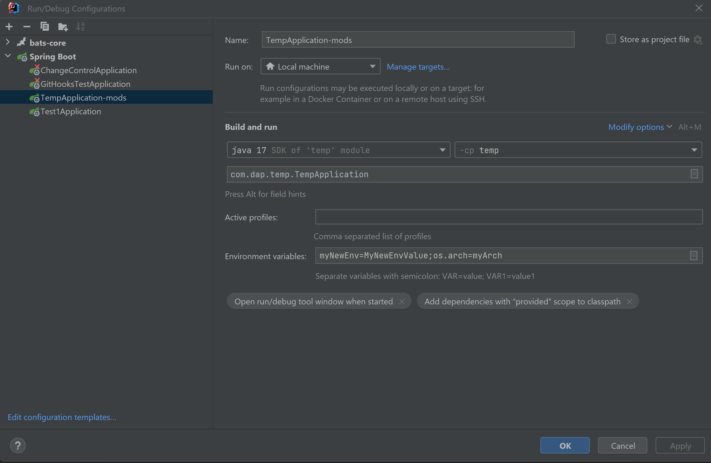

# Module: Retrieve Environment Variables


To test this project properly, the 
following needs to be done

Branches:
Master - uses JDK17 and Spring 3
JDK8 - uses JDK8 and Spring 2

1) Create a run configuration for this application 
    ```Run | Edit Configurations```



in this example, TestApplication-mods 
was created to run this program. the important
part is the 'Environment Variables' line.  
This line is not enabled by default. it is enabled
by clicking the 'Modify Options' link, and enabling 
'Environment Variables'.

In this example, two environment variables are being
included

* myNewEnv=MyNewEnvValue: this is a new environment 
variable that is being introduced
* os.arch=myArch: this environment variable is
overriding an existing system variable (at least
on my machine). 

2) add properties to the application.properties file
```
COMPUTERNAME=FOOBAR
myNewEnv=MyNewEnvValue2
os.arch=myArch2
anotherNewVar=AnotherNewVar
```

* COMPUTERNAME is an override to a system environment property
* myNewEnv is an override to the new variable previously added. 
this myNewEnv is 
overriding the myNewEnv listed in the Environment Variables 
section described above
* os.arch is an override to an override to a system property.
this value will override the value that was used in the 
Environment Variables section described above that overrides
the original system properties

3) when this program is run, all the system 
environment variables are displayed. of interest are 
the following lines

```
******* systemProperties *******
     New Property: os.arch = amd64

******* systemEnvironment *******
     New Property: COMPUTERNAME = DANXPS
     New Property: myNewEnv = MyNewEnvValue
Override Property: os.arch = myArch (Last Value = amd64; Orig Value = amd64)

******* Config resource 'class path resource [application.properties]' via location 'optional:classpath:/' *******
   Override Property: COMPUTERNAME = FOOBAR (Last Value = DANXPS; Orig Value = DANXPS)
        New Property: anotherNewVar = AnotherNewVar
   Override Property: myNewEnv = MyNewEnvValue2 (Last Value = MyNewEnvValue; Orig Value = MyNewEnvValue)
   Override Property: os.arch = myArch2 (Last Value = myArch; Orig Value = amd64)
   ```
